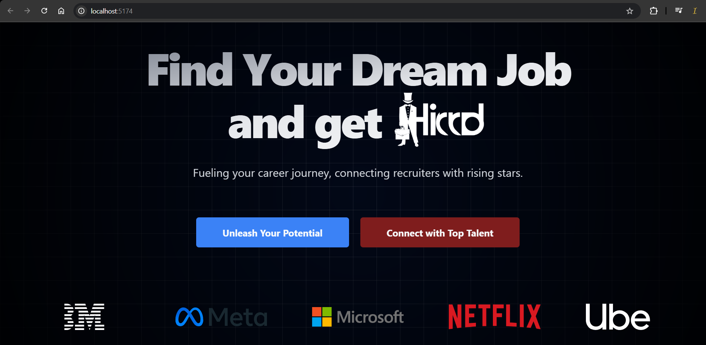
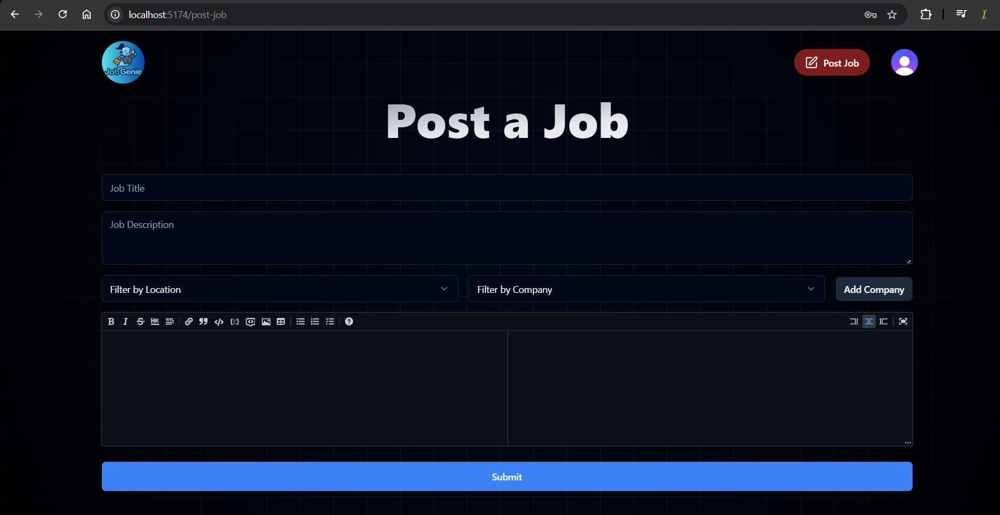

# 🚀 JobGenie

<div align="center">


### 💼 AI-Powered Recruitment Platform

**Find Your Dream Job. Connect with Top Talent.**

A modern full-stack recruitment platform that combines job searching, recruiter management, resume parsing, and AI-powered candidate screening into a single seamless experience.


</div>

---

## 📖 Overview

JobGenie is a full-stack AI-powered recruitment platform designed to streamline the hiring process for both recruiters and job seekers.

Unlike traditional job portals, JobGenie integrates intelligent resume analysis that automatically evaluates candidate resumes against job requirements and generates ATS-style match scores, helping recruiters identify suitable candidates faster.

Candidates can search jobs, save opportunities, upload resumes, and receive meaningful insights about their compatibility with specific job roles.

---

## ✨ Features

### 👨‍💼 Recruiters

* Post and manage job listings
* Create rich job descriptions using Markdown Editor
* Manage company information
* View candidate applications
* Review AI-generated match scores
* Screen candidates efficiently

### 👨‍🎓 Job Seekers

* Browse latest job opportunities
* Search jobs by title
* Filter jobs by company
* Filter jobs by location
* Save favorite jobs
* Upload PDF resumes
* Apply directly through the platform
* Receive AI-powered skill analysis

### 🤖 AI Resume Analysis

The platform includes a custom ATS-style matching engine that:

* Extracts text from uploaded resumes
* Detects relevant technical skills
* Compares skills against job requirements
* Calculates candidate-job compatibility score
* Identifies matched skills
* Identifies missing skills
* Generates hiring feedback

Example:

```text
Match Score: 82%

Matched Skills:
✔ React
✔ Node.js
✔ JavaScript

Missing Skills:
✖ AWS
✖ Docker

Feedback:
Excellent Match 🚀
```

---

## 📸 Screenshots

### Landing Page



### Job Listings


### Recruiter Dashboard



---

## 🏗️ System Architecture

```text
React + Vite Frontend
          │
          ▼
   Clerk Authentication
          │
          ▼
    Express.js Backend
          │
          ├──────── Resume Upload
          │                │
          │                ▼
          │          PDF Parsing
          │                │
          │                ▼
          │        AI Skill Analysis
          │
          ▼
 Supabase Database & Storage
```

---

## 🛠️ Tech Stack

### Frontend

* React.js
* Vite
* Tailwind CSS
* React Router DOM
* React Hook Form
* Zod
* Radix UI
* Lucide React
* Markdown Editor

### Backend

* Node.js
* Express.js
* Multer
* PDF Parse
* CORS
* Dotenv

### Authentication

* Clerk

### Database & Storage

* Supabase PostgreSQL
* Supabase Storage

### AI & Parsing

* Resume Parsing
* Skill Extraction Engine
* ATS-style Resume Matching
* Candidate Scoring System

---

## 📂 Project Structure

```bash
JobGenie
│
├── frontend
│   ├── public
│   ├── src
│   │   ├── api
│   │   ├── components
│   │   ├── data
│   │   ├── hooks
│   │   ├── layouts
│   │   ├── lib
│   │   ├── utils
│   │   └── pages
│   │       ├── landingpage.jsx
│   │       ├── job-listing.jsx
│   │       ├── Job.jsx
│   │       ├── job-post.jsx
│   │       ├── my-jobs.jsx
│   │       ├── onboarding.jsx
│   │       └── saved-jobs.jsx
│
├── backend
│   ├── config
│   ├── controllers
│   ├── routes
│   ├── services
│   ├── uploads
│   ├── utils
│   └── server.js
│
└── README.md
```

---

## 🚀 Getting Started

### Clone Repository

```bash
git clone https://github.com/Ishika-45/JobGenie.git

cd JobGenie
```

### Frontend Setup

```bash
cd frontend

npm install

npm run dev
```

### Backend Setup

```bash
cd backend

npm install

node server.js
```

---

## 🔑 Environment Variables

### Frontend (.env)

```env
VITE_SUPABASE_URL=
VITE_SUPABASE_PUBLISHABLE_KEY=
VITE_CLERK_PUBLISHABLE_KEY=
```

### Backend (.env)

```env
PORT=5000

SUPABASE_URL=
SUPABASE_SERVICE_ROLE_KEY=
```

---

## 🤖 Resume Analysis Workflow

```text
Resume Upload
      │
      ▼
PDF Parsing
      │
      ▼
Skill Extraction
      │
      ▼
Job Requirement Analysis
      │
      ▼
Match Score Calculation
      │
      ▼
AI Feedback Generation
      │
      ▼
Store Results in Supabase
```

---

## 💡 Skills Demonstrated

* Full Stack Development
* React.js
* Express.js
* Authentication & Authorization
* REST APIs
* Resume Parsing
* Cloud Storage Integration
* ATS-style Resume Matching
* AI-based Candidate Evaluation
* Database Design
* File Upload Handling
* Responsive UI Development

---

## 🎯 Why JobGenie?

Most job portals simply connect recruiters and candidates.

JobGenie improves recruitment efficiency by introducing:

* AI-powered resume screening
* ATS-style candidate evaluation
* Automated skill matching
* Intelligent recruiter insights
* Cloud-based resume storage
* Modern and scalable architecture

---

## 🔮 Future Enhancements

* OpenAI-powered resume evaluation
* Semantic skill matching
* AI Interview Question Generator
* Email Notifications
* Real-Time Chat System
* Analytics Dashboard
* Resume Builder
* Interview Scheduling
* Candidate Recommendation Engine

---

## 🤝 Contributing

Contributions are welcome.

1. Fork the repository
2. Create a feature branch

```bash
git checkout -b feature/new-feature
```

3. Commit changes

```bash
git commit -m "Add new feature"
```

4. Push changes

```bash
git push origin feature/new-feature
```

5. Open a Pull Request

---

## 👨‍💻 Author

**Ishika-45**

GitHub Repository:

https://github.com/Ishika-45/JobGenie

---

## ⭐ Support

If you found this project useful:

⭐ Star the repository

🍴 Fork the repository

📢 Share it with others

---

## 📜 License

This project is licensed under the MIT License.
